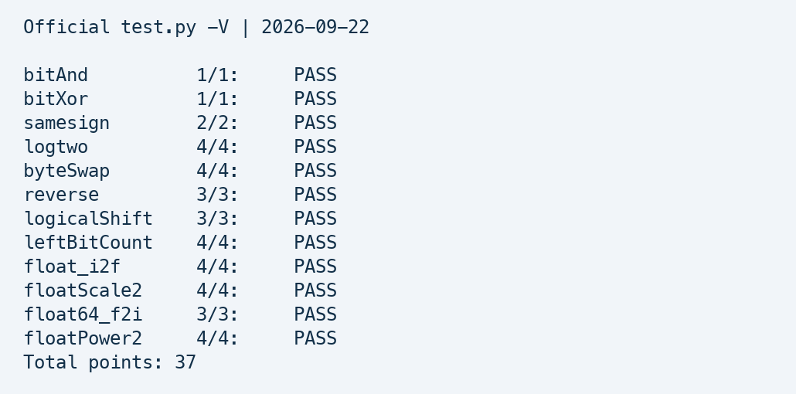

# DataLab 实验报告

姓名：待填写　　学号：待填写

## 实验结果与验证

2026-09-22，本地官方命令 `python3 test.py -V` 的结果为 **37/37**，12 个函数全部通过正确性和操作符合规检查。byteSwap 的题面 Difficulty 为 2，但评分脚本实际计 4 分，本报告按脚本记分。最终成绩仍取决于课程验收和答辩。

| 函数 | 得分 | 操作数 / 上限 |
| --- | --- | --- |
| bitAnd | 1/1 | 4/7 |
| bitXor | 1/1 | 7/7 |
| samesign | 2/2 | 9/12 |
| logtwo | 4/4 | 17/25 |
| byteSwap | 4/4 | 12/17 |
| reverse | 3/3 | 23/30 |
| logicalShift | 3/3 | 11/20 |
| leftBitCount | 4/4 | 34/50 |
| float_i2f | 4/4 | 20/30 |
| floatScale2 | 4/4 | 11/30 |
| float64_f2i | 3/3 | 15/60 |
| floatPower2 | 4/4 | 9/30 |



额外使用独立参考实现检查 1,000,000 组固定种子随机输入，并覆盖整型端点、32 种移位距离、全部双精度指数域及两种符号、前导连续 1 的全部长度、整数转浮点的舍入边界。共 12,008,623 项检查通过。验证程序以 `-O2 -Wall -Wextra -Werror -fsanitize=undefined -fno-sanitize-recover=all` 编译运行，无警告、无未定义行为检测报错。随机测试不是全输入空间的形式证明。

## 整数题思路

### bitAnd 与 bitXor

bitAnd 使用德摩根定律：对两个操作数分别取反，再求或并整体取反。bitXor 将两种相同位排除：`~(x & y)` 排除同时为 1，`~(~x & ~y)` 排除同时为 0，二者求与只留下不同位，恰好使用 7 次操作。

### samesign

符号位相同且“是否为零”相同才返回 1。对两个算术右移 31 位的结果异或并逻辑取反，判断符号位；对 `!x`、`!y` 异或并取反，区分零与正数。这样 (0,0) 为真，而 (0,1)、(0,-1) 均为假。

### logtwo

对正整数分五级查找最高有效位。依次判断是否超过 65535、255、15、3，按结果右移 16、8、4、2 位，最后取剩余值的高位。各级贡献分别占答案的不同位，所以用或代替加法。结果为向下取整的二进制对数，v=1 时返回 0。

### byteSwap

令 a=8n、b=8m，取两个字节的异或差值 delta。将 delta 分别移到两个字节位置并异或回原数，即可交换；n=m 时差值为 0，输入不变。代码只声明 int 变量，没有显式类型转换。移位表达式使用 `255u` 掩码，使左移在无符号类型上进行，避免字节移入最高位时出现有符号左移溢出。这里存在有意的通常算术转换；返回值按题目既定的 32 位补码平台解释。若课程人工验收对 README 中“尽量避免隐式转换”的要求采用更严格解释，需要向助教说明此处用途，而不能只凭脚本通过认定人工验收通过。

### reverse

先交换相邻单个位，再依次交换相邻 2 位、4 位、8 位、16 位分组。每一级掩码使左右两部分不重叠，五级操作完成 32 位逆序。全程使用题目明确允许的 unsigned，最高位移动也不会发生有符号溢出。

### logicalShift

n>0 时，以 `0x7fffffff >> (n-1)` 保留算术右移后的低 32-n 位，清除符号扩展。用 `isZero=!n` 将实际掩码移位量写为 n-1+isZero，保证 n=0 时也不会右移负数位数。最后用零移位掩码补回原数，使 n=0 精确返回 x，n=31 仅返回最高位。

### leftBitCount

先将 x 取反，将问题变成统计前导零。按 16、8、4、2、1 位分段检查；每次检查均在原始取反值上右移，以当前累计数量确定位置，避免左移负数。最后对取反值为零的情况额外加 1，补齐 x=-1 时的第 32 位。总计 34 次操作。

## 浮点题思路

### float_i2f

先处理零和符号。负数的幅值用 `-(x+1)` 后在无符号域加 1，避免直接对 INT_MIN 求负。将幅值左移直至最高位为 1，同时从 158 递减指数。保留 23 位尾数，末 8 位作为舍入余数：大于 128 向上舍入，小于 128 截断，等于 128 时只在保留尾数为奇数时加 1，实现最近偶数舍入。指数和尾数用加法拼接，使尾数进位自然传到指数。正负 16777217 等临界值以及 INT_MIN、INT_MAX 均已验证。

### floatScale2

拆分符号、指数和尾数。指数全 1 时原样返回，保持无穷和 NaN 的载荷；指数为零时将尾数左移一位，允许自然进入规格化范围；普通规格化数将指数加一。若指数达到全 1，必须清空尾数得到无穷，不能产生 NaN。正负零的符号保留。

### float64_f2i

取出指数减去偏置 1023。实际指数小于 0 时向零截断为 0；大于 30 时直接返回 INT_MIN 位模式。指数为 31 时，无论是合法的 -2^31 还是越界输入，接口返回位模式均为 0x80000000，因此可合并处理。其他情形从高、低两个输入字中拼出含隐藏位的 32 位有效数，再右移 31-e 位。此时幅值不超过 INT_MAX，转换到 int 后施加符号不会溢出。NaN 和无穷因指数过大返回哨兵值。

### floatPower2

按指数分四段：x<-149 返回零；-149≤x<-126 返回非规格化尾数 `1u << (x+149)`；-126≤x≤127 返回偏置指数左移 23 位；x>127 返回正无穷。所有边界比较先于移位与偏置相加，INT_MIN、INT_MAX 输入也不会造成移位越界或加法溢出。

## 复现与提交说明

在仓库根目录运行：

```sh
python3 test.py -V
clang -O2 -std=gnu99 -Wall -Wextra -Werror \
  -fsanitize=undefined -fno-sanitize-recover=all \
  -I. bits.c report/verify.c -o /tmp/datalab-verify
/tmp/datalab-verify
```

`test-results.txt` 保存官方完整输出；`verify.c` 为报告附属的独立验证程序，不参与官方评分。原有评测器、Makefile 和参考答案未修改。官方编译在本机 Clang 下对 btest.c 的两个未使用累计变量给出警告；单独检查提交代码 bits.c 无警告，不修改评测器来隐藏这些提示。

提交前须填写真实姓名、学号并重新导出 PDF，在 OBE 填写本人 fork 仓库地址，并完成课程答辩。目前未执行 Git 提交、远端推送或 OBE 提交。

## 参考与辅助工具说明

依据本仓库 README.md、bits.c 函数契约、test.py 评分规则及 report/README.md 报告要求完成。实现、说明及附加验证由 OpenAI Codex 辅助生成与检查；本人需核对课程关于 AI 辅助的规定，并理解每题推导后再提交。没有虚构个人独立完成经历、投入时间或答辩结果。
